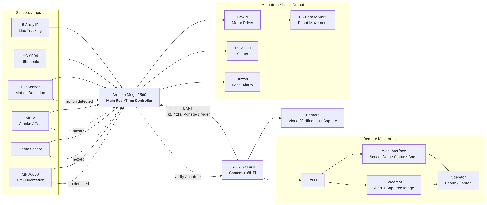
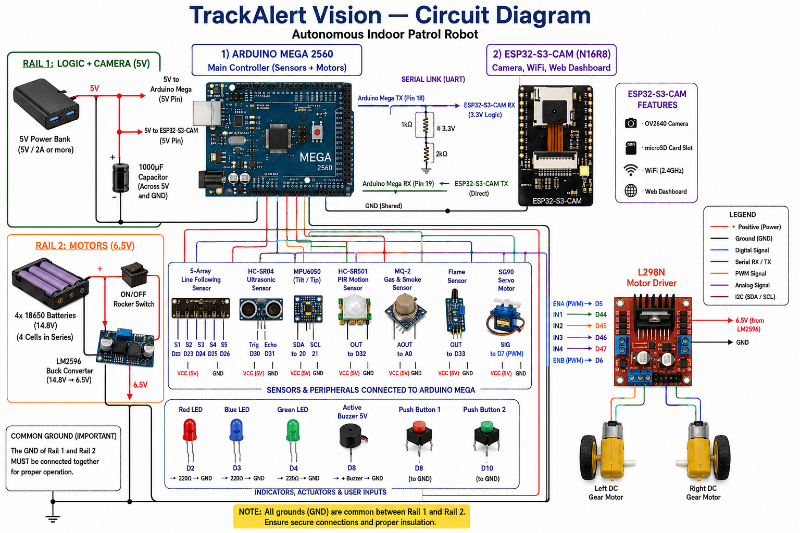
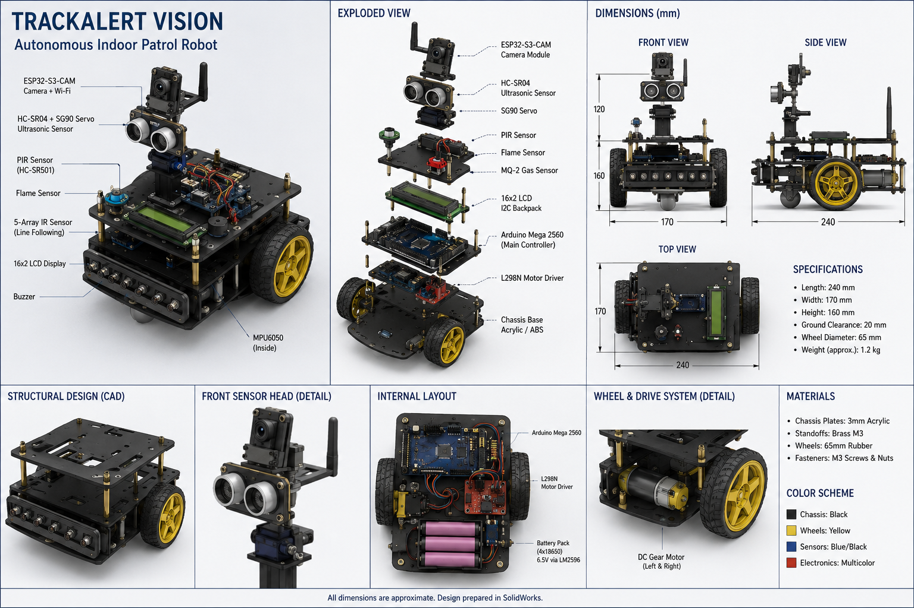
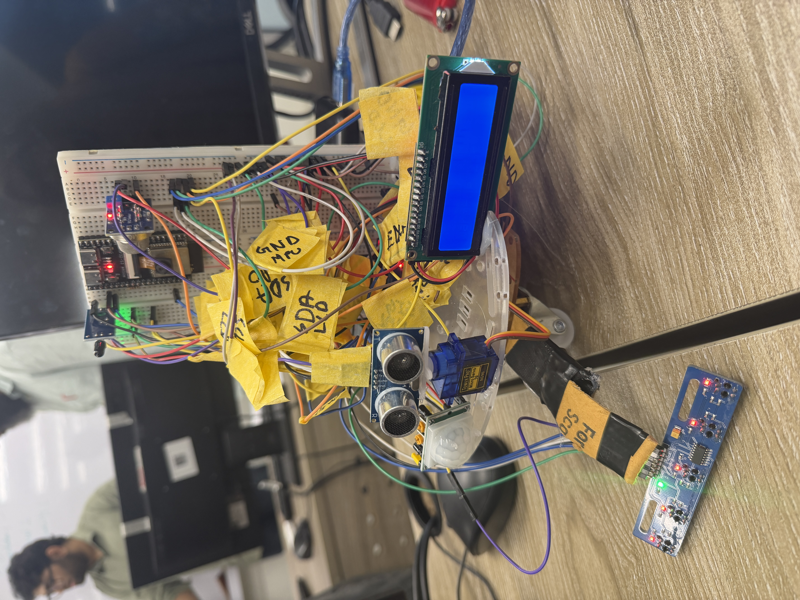
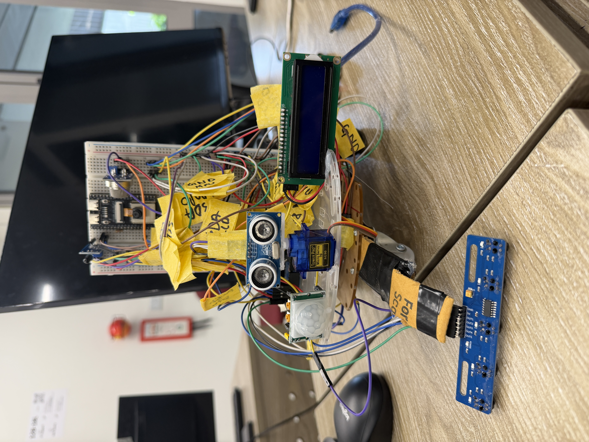
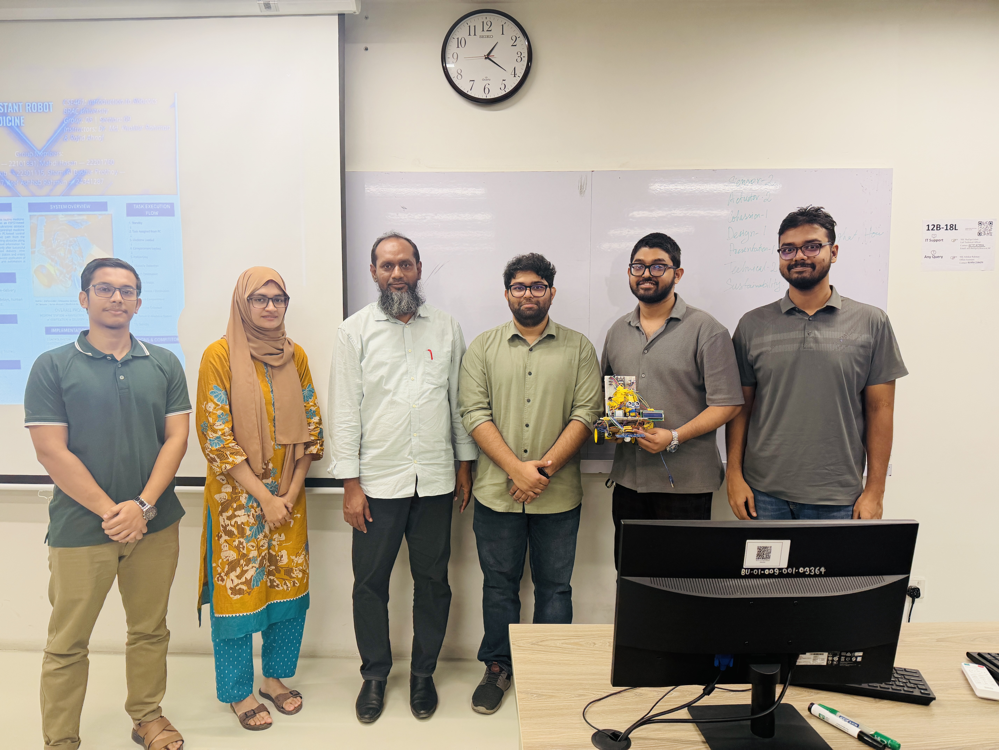
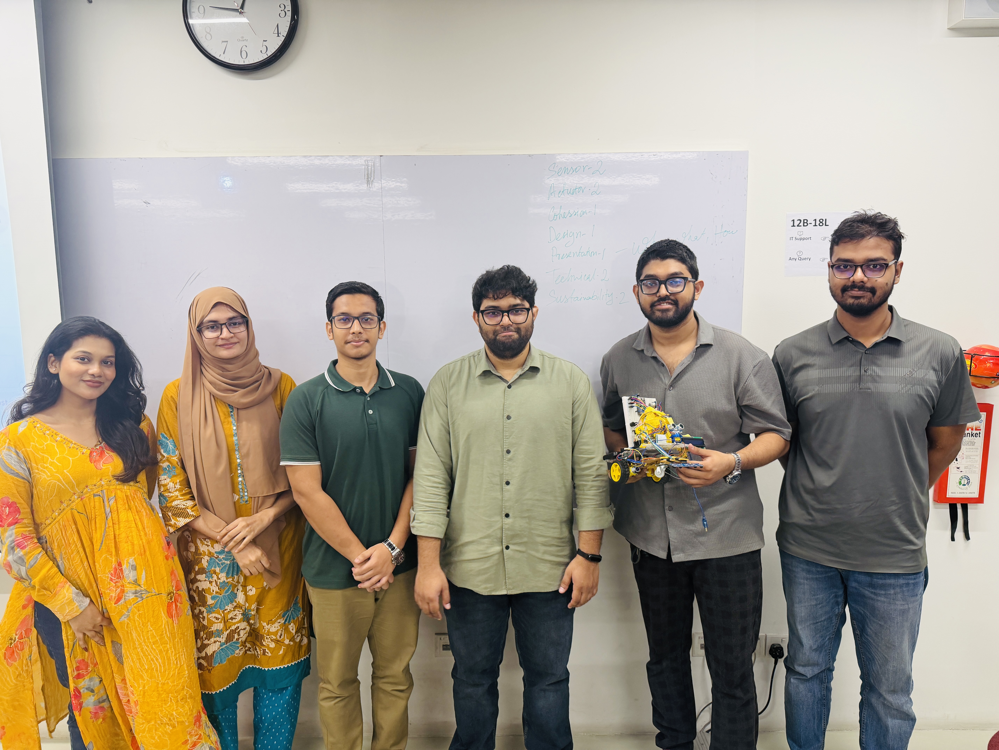

<div align="center">

# 🤖 TrackAlert Vision

### An Autonomous Line-Following Indoor Patrol & Hazard-Alert Robot

**Low-cost autonomous surveillance for warehouses, labs, storerooms and offices — patrols a fixed route, avoids obstacles, detects fire / smoke / intruders / tip-over, and pushes a photo alert to Telegram in real time.**


<sub>**BRAC University** · Department of Computer Science and Engineering · CSE461 Introduction to Robotics · Section 09, Group 01</sub>

</div>

---

## 📑 Table of Contents

- [Overview](#-overview)
- [Key Features](#-key-features)
- [Diagrams](#-diagrams)
- [Live Photos](#-live-photos)
- [Hardware](#-hardware)
- [Pin Map](#-pin-map)
- [Tuned Parameters](#️-tuned-parameters)
- [Getting Started](#-getting-started)
- [Test Results](#-test-results)
- [Repository Structure](#-repository-structure)
- [Limitations & Future Work](#-limitations--future-work)
- [Team](#-team)
- [References](#-references)
- [License](#-license)

---

## 📌 Overview

Indoor security today relies either on human guards (expensive, tiring, error-prone) or on fixed cameras (blind spots, no mobility). **TrackAlert Vision** sits between the two: a small wheeled robot that follows a taped route around a facility, senses its environment continuously, and escalates to a human operator only when something actually happens.

The robot runs a **two-controller architecture**:

| Controller | Responsibility |
|---|---|
| **Arduino Mega 2560** | Real-time control — line following, obstacle avoidance, hazard sensing, motor drive, LCD/buzzer, safety interlocks |
| **ESP32-S3-CAM** | Vision and connectivity — image capture, Wi-Fi, Telegram bot, remote commands |

The two boards talk over a **UART link with a 5V→3.3V divider**. When the Mega confirms a hazard, it emits an event string (`EVT:FIRE`, `EVT:GAS`, `EVT:INTRUDER`, `EVT:TILT`, `EVT:CLEAR`); the ESP32 captures a frame and delivers a **photo + caption to the operator's Telegram** within seconds.

> **Design philosophy:** MOVE → MONITOR → DETECT → RESPOND → REPORT.

---

## ✨ Key Features

| # | Capability | How it works |
|---|---|---|
| 1 | **PD line following** | 5-array IR sensor, weighted error, filtered derivative term, slew-rate-limited PWM to kill wheel slip |
| 2 | **Sharp-corner pivot mode** | When only an outer sensor sees black, the robot pivots on the spot instead of arcing — clears true 90° track corners |
| 3 | **Junction commit window** | On a 4–5 sensor crossing it drives straight for a fixed window instead of re-deciding every 10 ms and grabbing a branch |
| 4 | **Gyro-measured box manoeuvre** | Obstacle → stop → 90° left → sidestep → 90° right → drive past → 90° right → creep to line → 90° left → resume. Turns are **measured with the MPU6050 Z-gyro**, not timed |
| 5 | **Expanding lost-line recovery** | Reverse onto the line, then sweep outward (near side → far side → wider → wider) around the last known error sign |
| 6 | **Stop-and-scan intruder detection** | Servo sweeps the head while stationary; PIR is only trusted when the chassis is still — this eliminated the false-trigger problem |
| 7 | **Fire & smoke, always on** | Flame + MQ-2 polled at every step of every routine, including mid-turn and mid-avoidance |
| 8 | **Auto-polarity flame learning** | Reads the idle level at boot and treats the opposite level as fire — no more wiring-dependent false alarms |
| 9 | **MQ-2 warm-up gate & arming latch** | Gas sensor is ignored for the first 60 s; a sensor already reading "hazard" at boot must go clean once before it can fire |
| 10 | **Tip-over detection** | MPU6050 accelerometer Z-axis; motors freeze and an `EVT:TILT` alert is sent |
| 11 | **Freeze-until-reset safety** | On any alert the robot halts, sounds the buzzer, shows the cause on the LCD, and stays frozen until a debounced reset press |
| 12 | **Remote Telegram commands** | `/capture`, `/photo`, `/status`, `/help` — owner chat ID only |

---

## 📐 Diagrams

All source diagrams live in [`Diagrams/`](Diagrams).

### Figure 1 — Concept Diagram

<div align="center">
  
</div>

<p align="center"><em>Sensor inputs → Arduino Mega decision layer → actuators, with confirmed hazard events forwarded over UART to the ESP32-S3-CAM for capture and remote alerting.</em></p>

```
Sensors → Arduino Mega (decide + drive motors)
        → on a hazard, Mega signals the ESP32-S3-CAM
        → ESP32 captures an image and sends it over Wi-Fi to the operator's Telegram
```

| Layer | Elements |
|---|---|
| **Inputs** | 5-Array IR line tracking · HC-SR04 ultrasonic · PIR motion · MQ-2 smoke/gas · Flame · MPU6050 IMU |
| **Control** | Arduino Mega 2560 — line following, obstacle avoidance, hazard confirmation, freeze/reset state machine |
| **Local output** | L298N → DC gear motors · 16×2 LCD status · buzzer alarm |
| **Vision & link** | ESP32-S3-CAM over UART with a 1kΩ/2kΩ divider — visual verification and capture |
| **Remote** | Wi-Fi → Telegram alert with image → operator phone / laptop |

<br>

### Figure 2 — Circuit Diagram

<div align="center">
  
</div>

<p align="center"><em>Dual power rails, sensor and peripheral wiring, the Mega ↔ ESP32 UART divider, and the L298N motor stage.</em></p>

> 📌 **Note:** this diagram was drawn during the design phase and shows an earlier pin assignment for a few peripherals (line array D22–D26, HC-SR04 D30/D31). The **[Pin Map](#-pin-map) section reflects the shipped firmware and the final wiring reference** — follow that when building.

<br>

### Figure 3 — CAD Diagram

<div align="center">
  
</div>

<p align="center"><em>Exploded view, orthographic dimensions, internal layout and drive detail. Prepared in SolidWorks.</em></p>

| Specification | Value |
|---|---|
| Length × Width × Height | 240 × 170 × 160 mm |
| Ground clearance | 20 mm |
| Wheel diameter | 65 mm |
| Weight (approx.) | 1.2 kg |
| Chassis plates | 3 mm acrylic |
| Standoffs / fasteners | Brass M3 · M3 screws & nuts |

**Stack order (bottom → top):** chassis base → L298N motor driver → Arduino Mega 2560 → 16×2 LCD → PIR / flame / MQ-2 deck → SG90 servo → HC-SR04 → ESP32-S3-CAM on the mast. The 5-array IR sensor mounts on a forward boom under the front edge; the MPU6050 sits internally near the chassis centre.

---

## 📸 Live Photos

Photographs of the assembled prototype are in [`Livephotos/`](Livephotos).

<table>
<tr>
<td width="50%" align="center">
  
  <br><sub><b>Assembled prototype</b> — breadboarded Mega stack, labelled harness, servo-mounted HC-SR04, PIR and backlit 16×2 LCD, with the 5-array line sensor on its forward boom.</sub>
</td>
<td width="50%" align="center">
  
  <br><sub><b>Sensor head & wiring</b> — the ESP32-S3-CAM on its mast, the SG90-steered ultrasonic head, and the taped-and-labelled sensor harness.</sub>
</td>
</tr>
</table>

---

## 🔩 Hardware

### Bill of Materials

| # | Component | Qty | Purpose |
|---|---|---|---|
| 1 | ESP32-S3-CAM (N16R8, OV2640) | 1 | Vision, Wi-Fi, Telegram |
| 2 | Arduino Mega 2560 | 1 | Main real-time controller |
| 3 | 5-Array Line Following Sensor | 1 | Route navigation |
| 4 | HC-SR04 Ultrasonic + SG90 Servo | 1 each | Steerable obstacle scanning |
| 5 | MPU6050 IMU | 1 | Turn measurement + tip-over |
| 6 | HC-SR501 PIR | 1 | Intruder / motion |
| 7 | MQ-2 Gas & Smoke Sensor | 1 | Smoke, LPG, combustible gas |
| 8 | Flame Sensor Module | 1 | Fire |
| 9 | L298N H-Bridge Motor Driver | 1 | Motor control |
| 10 | 2-Wheel Robot Chassis + DC gear motors | 1 | Mobility |
| 11 | 16×2 I2C LCD (0x27) | 1 | Local status |
| 12 | Active Buzzer 5V + Reset Push Button | 1 each | Local alarm + resume |
| 13 | LM2596 Buck Converter | 1 | 15V → 6.5V motor rail |
| 14 | 4× 18650 Li-ion 3000 mAh + holder | 1 set | Motor power |
| 15 | Rocker switch, capacitors, resistors, LEDs, jumpers | — | Power & prototyping |

**Total build cost: ৳4,479 BDT (~$37 USD)** after discount — deliberately kept below the price of a single fixed IP camera.

### Power Architecture — Two Rails, One Ground

| Rail | Path |
|---|---|
| **Logic** | 5V power bank → Arduino Mega 5V + all sensors |
| **Camera** | 5V power bank (USB-C) → ESP32-S3-CAM |
| **Motors** | 4×18650 (~15V) → ON/OFF switch → LM2596 (set 6.5V) → L298N +12V |
| **L298N logic** | Arduino 5V → L298N +5V pin (5V-EN jumper **removed**) |

> ⚠️ **Common ground is mandatory.** Power-bank GND + Arduino GND + buck OUT− + L298N GND + ESP32 GND must all be joined, or the sensors and the board-to-board serial link will not work.

---

## 📍 Pin Map

### Motors — L298N → Arduino Mega

| L298N | Mega | Note |
|---|---|---|
| ENA | D5 | Left motor speed (PWM) |
| IN1 / IN2 | D44 / D45 | Left direction |
| IN3 / IN4 | D46 / D47 | Right direction |
| ENB | D6 | Right motor speed (PWM) |
| +12V (VS) | Buck 6.5V | Motor supply |
| +5V | Arduino 5V | Logic (5V-EN jumper OFF) |

> Remove **all three** L298N jumper caps — the 5V-EN jumper and both ENA/ENB caps — so the Arduino feeds logic power and D5/D6 control speed.

### Sensors → Arduino Mega

| Component | Pin(s) | Note |
|---|---|---|
| Line array OUT1–OUT5 | D42, D38, D34, D30, D26 | Read reversed in code: `LINE[5] = {26,30,34,38,42}`, `LINE_ON_BLACK = false` |
| SG90 servo signal | D7 | Aims the ultrasonic head |
| HC-SR04 TRIG / ECHO | D28 / D29 | |
| PIR Dout | D32 | HIGH on motion, H-mode jumper |
| Flame DO | D33 *(see note)* | Auto-polarity learned at boot |
| MQ-2 AO | A0 | Analogue, ~30–60 s warm-up |
| MPU6050 SDA / SCL | D20 / D21 | I2C `0x68` |
| 16×2 LCD SDA / SCL | D20 / D21 | I2C `0x27` |
| Active buzzer + | D8 | |
| Reset button | D9 → GND | `INPUT_PULLUP`, LOW when pressed |

> 🔧 **Note:** the wiring reference documents the flame DO on **D33**; the shipped firmware declares `const int FLAME = 35;`. Set this constant to match your physical build before first run.

### Mega ↔ ESP32-S3-CAM Serial Link

| Connection | Detail |
|---|---|
| Mega TX1 (D18) | → 1kΩ → node → ESP32 RX (GPIO21); node → 2kΩ → GND *(5V→3.3V divider)* |
| Mega RX1 (D19) | ← ESP32 TX (GPIO47) — direct, no divider |
| Mega GND | ↔ ESP32 GND (mandatory) |

> ⚠️ The Servo library owns **Timer5** on the Mega, which drives PWM on pins 44/45/46. Those pins are `digitalWrite` only — never `analogWrite()` to them.

---

## 🎛️ Tuned Parameters

All speeds were deliberately lowered so a wrong turn is a correction, not a crash.

| Parameter | Value | Meaning |
|---|---|---|
| `BASE_SPEED` | 95 | Straight-line patrol |
| `MIN_TURN_SPEED` | 65 | At maximum line error |
| `PIVOT_SPEED` | 105 | On-the-spot 90° turns |
| `KP` / `KD` | 42 / 34 | PD gains (error scaled ×10) |
| `SLEW_STEP` | 18 | Max PWM change per 10 ms tick |
| `LINE_UPDATE_MS` | 10 | Fixed control interval |
| `OBSTACLE_CM` | 20 | Hard stop distance |
| `SLOW_CM` | 38 | Start easing off |
| `GAS_THRESHOLD` | 400 | MQ-2 analogue trip point |
| `CONFIRM_COUNT` | 3 | Spaced reads before an alert fires |
| `SCAN_INTERVAL_MS` / `SCAN_MS` | 5000 / 4000 | Patrol time between scans / scan duration |

---

## 🚀 Getting Started

### 1. Prerequisites

- Arduino IDE 2.x
- **Board packages:** Arduino AVR Boards, esp32 by Espressif Systems
- **Library:** `LiquidCrystal I2C` by Frank de Brabander
- A Telegram bot token from [@BotFather](https://t.me/BotFather) and your numeric chat ID

### 2. Flash the Arduino Mega

```
Board:  Arduino Mega or Mega 2560
Sketch: Codes/FINAL_ARDUINO_MEGA_v5_1.ino
```

### 3. Flash the ESP32-S3-CAM

```
Board:            ESP32S3 Dev Module
PSRAM:            OPI PSRAM
USB CDC On Boot:  Enabled
Sketch:           Codes/FINAL_ESP32_CAM_v3.ino
```

Set your credentials before uploading:

```cpp
const char*  WIFI_SSID = "YOUR_SSID";
const char*  WIFI_PASS = "YOUR_PASSWORD";
const String BOT_TOKEN = "YOUR_BOT_TOKEN";
const String CHAT_ID   = "YOUR_CHAT_ID";
```

### 4. Calibrate & Run

1. Lay a **black electrical-tape track** on a light-coloured floor.
2. Power on and **keep the robot completely still** for the 30 s warm-up — this is when the gyro zero-bias and the flame idle polarity are learned.
3. Watch the serial monitor at **115200 baud** (`DEBUG_SENSORS 1` prints live flame / gas / PIR / distance / line / error values every second).
4. Tune the line-sensor potentiometers until all five sensors read `0` over black and `1` over white.
5. Read the resting MQ-2 value and set `GAS_THRESHOLD` comfortably above it.
6. If the robot steers the wrong way, flip `LINE_ON_BLACK`.
7. If the MPU6050 is not detected, the code falls back to timed turns — calibrate `PIVOT_90_MS` by eye.

---

## ✅ Test Results

Tested indoors on a black electrical-tape track over light floor tiles. Every subsystem was validated individually, then integrated.

| Feature / Test | Result | Notes |
|---|---|---|
| Line following (straight + gentle curves) | ✅ Working | Stable after reversing sensor order and setting polarity (0 = black) |
| 5-array sensor calibration | ✅ Working | All five sensors flip cleanly after sensitivity tuning |
| Obstacle avoidance + line recovery | ✅ Working | Detect → turn → pass → drive until line re-detected |
| PIR intruder detection | ✅ Working | Reliable at ~1 m; read only during stop-and-scan |
| Flame detection | ✅ Working | Triggers on a nearby flame (~20–50 cm) |
| Gas / smoke detection (MQ-2) | ✅ Working | Analogue threshold; requires ~30 s warm-up |
| Tilt detection (MPU6050) | ✅ Working | Motors stop when the robot is tipped |
| Image capture → Telegram | ✅ Working | Photo delivered on every alert |
| Alert + buzzer + LCD + freeze/reset | ✅ Working | Robot freezes on alert, resumes on reset press |

### Engineering Problems Solved

| Problem | Root cause | Fix |
|---|---|---|
| Robot lost the line at speed | PWM jumps → wheel slip | Slew-rate limiter + lower base speed |
| Weaving on straights | Raw derivative amplified sensor noise | Filtered D term |
| Cut corners / left the track | Arcing on true 90° corners | Sharp-corner on-the-spot pivot mode |
| Grabbed the wrong branch at crossings | Re-deciding every 10 ms | Junction commit window |
| Inconsistent avoidance turns | Timed pivots vary with battery and floor | MPU6050 gyro-measured turns with boot calibration |
| Constant false intruder alerts | PIR triggered by the robot's own motion | PIR read only while stationary (stop-and-scan) |
| Flame false alarms | Module polarity varies by wiring | Auto-polarity learning + arming latch at boot |
| `/capture` command ignored | Response reader exited while data was still buffered; JSON truncated at 3 KB | Read while *connected OR available*, 5 KB buffer, header-skip, digit-wise chat-ID parse |

---

## 📂 Repository Structure

```
TrackAlert-Vision/
│
├── Codes/                              # Firmware
│   ├── FINAL_ARDUINO_MEGA_v5_1.ino     # Main controller — navigation, hazards, safety
│   └── FINAL_ESP32_CAM_v3.ino          # Vision + Wi-Fi + Telegram bot
│
├── Diagrams/                           # System design figures
│   ├── ConceptDiagram.png              # Figure 1 — data flow & architecture
│   ├── Circuit_diagram.png             # Figure 2 — full circuit & wiring
│   └── CAD_diagram.png                 # Figure 3 — CAD / mechanical design
│
├── Livephotos/                         # Photographs of the built prototype
│   ├── ProjectPhoto1.JPG
│   ├── ProjectPhoto2.JPG
│   ├── TeamPhoto.JPG
│   └── Teamphoto2.JPG                  # with the course instructors
│
├── 01_09.pdf                           # Full lab project report
├── TrackAlert_Final_Pin_Diagram.pdf    # Authoritative wiring reference
├── CSE461_Sectio09_Group01_poster.pdf  # Project poster
└── README.md
```

| Folder / File | Contents |
|---|---|
| [`Codes/`](Codes) | Both Arduino sketches — flash the Mega first, then the ESP32 |
| [`Diagrams/`](Diagrams) | Concept, circuit and CAD figures used throughout this README |
| [`Livephotos/`](Livephotos) | Build and demonstration photographs |
| `01_09.pdf` | Full report — abstract, methodology, results, contributions |
| `TrackAlert_Final_Pin_Diagram.pdf` | Final pin-by-pin wiring reference (authoritative) |
| `CSE461_Sectio09_Group01_poster.pdf` | Poster presented at the lab showcase |

---

## 🔭 Limitations & Future Work

**Current limitations**

- Navigation depends on a physical line — dirt or a break in the tape disrupts the route.
- Ultrasonic sensing gives far less environmental information than LiDAR.
- The system cannot yet distinguish an authorised operator from an intruder.
- ESP32-CAM processing power caps on-board vision work.

**Planned improvements**

- Multiple patrol routes and scheduled patrols
- LiDAR-based navigation for line-free environments
- Industrial-grade sensors and improved power management
- Cloud-based monitoring dashboard and historical logging
- On-device AI (person / face recognition) with a more capable camera

---

## 👥 Team

**BRAC University** · Department of Computer Science and Engineering
**CSE461: Introduction to Robotics** · Section 09, Group 01

**Course Instructors:** Md. Khalilur Rahman, PhD (KHR) · Rafid Ahnaf (RFF)

| Name | ID | Role | Contribution |
|---|---|---|---|
| **Ahsan Habib** 🏅 | 22201027 | **Team Lead · Lead Architect · Embedded Systems & Autonomous Navigation** | System architecture and integration strategy; line-following control (5-array sensing, PD + slew-limited steering, corner and junction handling); obstacle avoidance (servo + ultrasonic scanning, gyro-measured box manoeuvre, route recovery); Telegram bot image capture and alert messaging |
| Rezowana Mehjabin Lorel | 20201089 | Hardware Design, Circuit Building & Power Management | Chassis assembly, L298N wiring, 18650 battery pack, LM2596 buck converter, common ground |
| Sharan Mistry | 22201779 | Embedded Systems, Wireless Communication & Intruder Detection | ESP32-S3-CAM setup (camera + Wi-Fi), Mega ↔ ESP32 UART link, PIR-based intruder detection with stop-and-scan |
| Atahar Shihab | 22301336 | Safety Systems, Software Integration & Documentation | MPU6050 tilt detection, software integration and testing, project report |
| Maliha Binte Shamim | 23101466 | Software Design, Environmental Monitoring & Alert Systems | Flame and MQ-2 gas/smoke detection, threshold calibration, buzzer/LCD alerts, freeze-until-reset logic |

---

## 📚 References

1. Arduino. *Obstacle avoiding robot.* Arduino Project Hub.
2. Lough, B. *Universal Arduino Telegram Bot — ESP32Cam send photo example.* GitHub.
3. Santos, R., & Santos, S. (2024). *Telegram: ESP32-CAM take and send photo (Arduino IDE).* Random Nerd Tutorials.
4. Lee. (2024). *Building a line follower robot with obstacle avoidance.* YouTube.
5. MA Robotic. (2022). *Line follower with obstacle avoiding robot — Arduino and L298 motor driver.* YouTube.
6. Techatronic. (2024). *Line following robot Arduino tutorial.*

---

## 📄 License

Released under the **MIT License** for academic and educational use.

---

## 🙏 Thanks for Visiting

<div align="center">



<sub><b>Group 01 with our course instructors</b> — <b>Md. Khalilur Rahman, PhD (KHR)</b> and <b>Rafid Ahnaf (RFF)</b>, on final demonstration day.<br>
Our sincere thanks to both of them for their guidance, patience and feedback throughout CSE461.</sub>

<br>



<sub><b>Group 01, Section 09</b> — final demonstration day, CSE461 Introduction to Robotics, BRAC University.</sub>

<br><br>

**Thank you for visiting our project repository.**
**Google Drive link:** <a href="[https://drive.google.com/drive/folders/1lwfewMTtvOZvEcsnVSsrud3aUyajPg3f?usp=sharing]">**Visit Github:CSE461**</a>

From the five of us who taped the track, chased the false alarms and re-soldered the harness more times than we would like to admit — we hope TrackAlert Vision is useful to you. Questions, forks and improvements are all welcome.

<br>

**Built at BRAC University · CSE461 Introduction to Robotics**

*MOVE → MONITOR → DETECT → RESPOND → REPORT*

</div>
